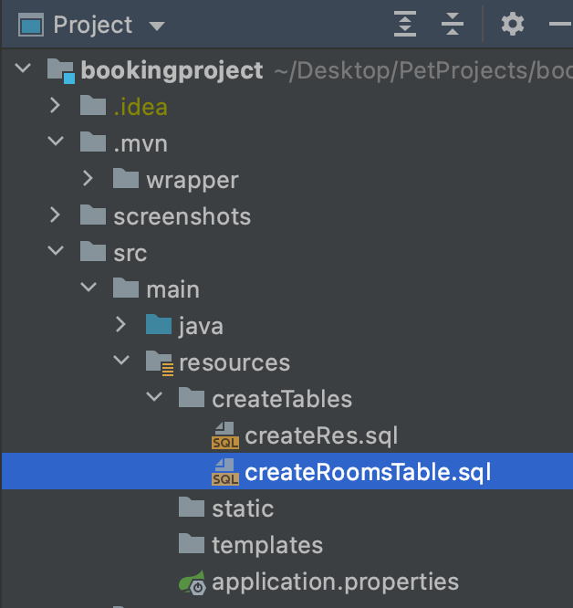
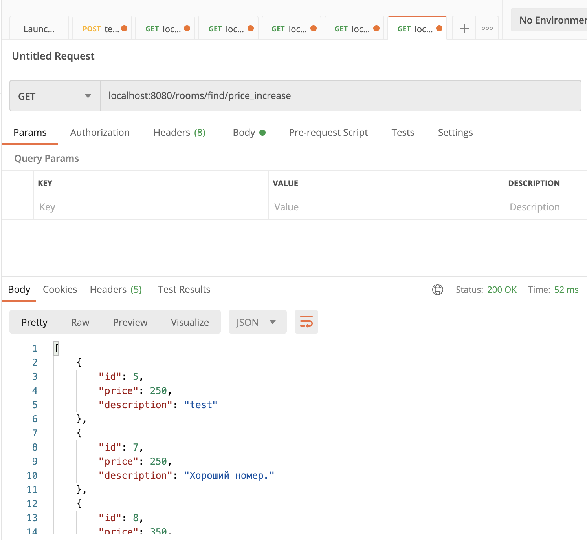

## Помощник управляющего

***

Перед вами простой сервис, созданный для управления номерами и бронированиями
отеля.

При его создании использовался язык Java в совокупности с фреймфорком
Spring. В качестве СУБД был взят MySQL.

### Инструкция для запуска:
***

1. Загрузив проект в IDE через version control, подключите свою локальную
  базу данных MySQL.

2. В файле "application.properties" установите ссылку, имя пользователя и пароль
   от вашей базы данных.

   
   

3. Запустите sql скрипты "createRes.sql" и "createRoomsTable.sql" для создания таблиц "rooms" и "reservations":

    

4. Структура базы данных должна быть такой:

   

5. Готово!

### Сценарии использования
***
Данный сервис умеет следующее:

* Он может **добавить номер отеля**. При этом возвращая его id.

  

***
* Он может **удалять номер отеля** из базы данных. При этом удаляются
  все брони на этот номер.

  

***
* Также есть возможность **получить список всех номеров отеля**. С помощью
  дефолтного запроса ../rooms выводится список, отсортированный по дате
  добавления. А с помощью запросов ../rooms/findall/priceincrease и ../rooms/findall/pricedecrease
  соответственно, отсортированные по цене по возрастанию и убыванию.

  

***
* Возможно обновить номер по его id. То есть можно изменить цену или
описание номера.

  

***
* Более того, сервис **может добавить бронь**! Возвращая при этом ее ID. Согласитесь,
  было бы нелогично добавлять бронь на несуществующий номер. Поэтому при такой попытке возникает ошибка.

  

  

***
* Также, сервис способен **получить список всех броней отеля**.

  

***
* И **удалить бронь** по ее id.

  

***
* Возможно также обновить бронирование по id. При этом нельзя обновить бронирование
на несуществующий номер.

  

***
* Кроме того, сервис способен **получить список броней для конкретного номера отеля**.

  

### Документация

***

* Команда для **получения списка всех броней**:
      
    `curl -X GET "http://localhost:8080/reservations/find"`

* Команда для **получения брони по ее ID**:
    
    `curl -X GET "http://localhost:8080/reservations/find/id={id}"`

* Команда для **создания брони**:

    `curl --location --request POST 'localhost:8080/reservations/create' \
  --header 'Content-Type: application/json' \
  --data-raw '{
  "checkIN": "2021-01-15",
  "checkOUT": "2021-01-19",
  "roomID": 5
  }'`
  

* Команда для **получения списка броней номера отеля**:

    `curl -X GET 'localhost:8080/rooms/getreservations/id={id}'`

* Команда для **добавления номера отеля**:

    `curl --location --request POST 'localhost:8080/rooms/create' \
  --header 'Content-Type: application/json' \
  --data-raw '{
  "price": 400,
  "description": "Полулюкс."
  }'`
  

* Команда для **удаления номера отеля и всех его броней**:

  `curl -X DELETE 'localhost:8080/rooms/delete/id={id}'`

* Команда для **обновления информации по бронированию**:

    `curl --location --request PUT 'localhost:8080/reservations/update/id={id}' \
  --header 'Content-Type: application/json' \
  --data-raw '{
  "checkIN": {date check in},
  "checkOUT": {date check out},
  "roomID": {ID of room}
  }'`

* Команда для **обновления информации по номеру отеля**:

  `curl --location --request PUT 'localhost:8080/rooms/update/id={id}' \
  --header 'Content-Type: application/json' \
  --data-raw '{
  "price": {price of room},
  "description:" {description of the room}
  }'`
  

* Команда для **получения списка номеров отеля**, отсортированного по:

  * Дате добавления номера (по возрастанию):
  
    `curl -X GET 'localhost:8080/rooms/find'`
  
  * Дате добавления номера (по убыванию):

    `curl -X GET 'localhost:8080/rooms/find/date_decrease'`
    
  
  * По цене (по возрастанию)
  
    `curl -X GET 'localhost:8080/rooms/find/price_increase'`
  
  * По цене (по убыванию):
  
    `curl --location -X GET 'localhost:8080/rooms/find/price_decrease'`
